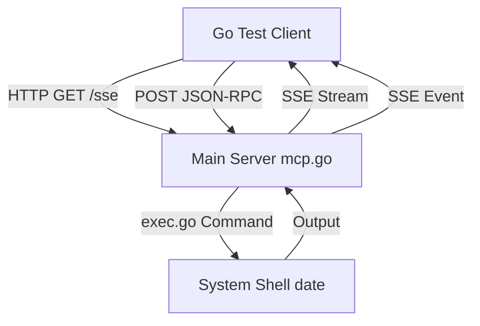
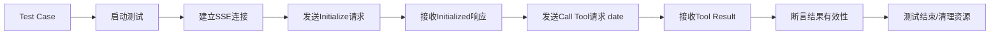

## Product Overview

在tests目录下创建Go测试程序，用于验证MCP SSE协议功能。该测试将模拟MCP客户端，通过SSE连接发送请求，执行服务器端的`date`命令，以确认MCP选项功能运行正常。

## Core Features

- 建立与本地MCP服务器的SSE连接
- 构造并发送执行`date`命令的工具调用请求
- 接收并解析SSE事件流响应
- 验证返回的日期时间数据格式正确性
- 确保连接正常关闭

## Tech Stack

- **语言**: Go (Golang)
- **测试框架**: 标准库 `testing` 包
- **HTTP客户端**: `net/http` 用于发送请求和处理SSE流
- **断言库**: 可选引入 `testify/assert` 或直接使用标准库判断
- **并发控制**: 使用 `sync` 包或 `context` 管理测试生命周期

## Architecture Design

### System Architecture

采用客户端-服务器架构进行测试。测试程序作为客户端，启动的服务器（main.go）作为服务端。



### Data Flow



## Implementation Details

### Core Directory Structure

```text
project-root/
├── tests/
│   └── mcp_sse_test.go  # 新增测试文件
├── main.go              # 待测试服务入口
├── mcp.go               # 待测试MCP逻辑
└── exec.go              # 待测试命令执行
```

### Key Code Structures

**测试文件结构 (`tests/mcp_sse_test.go`)**:

```
package tests

import (
    "testing"
    "net/http"
    "encoding/json"
    "bytes"
    // 其他依赖包
)

func TestMCPExecuteDateCommand(t *testing.T) {
    // 1. 启动服务器或使用已运行的服务器
    // 2. 建立 SSE 连接
    // 3. 发送 JSON-RPC 请求调用 date 工具
    // 4. 读取 SSE 流并解析响应
    // 5. 验证返回结果
}

// 辅助函数：解析SSE流
func readSSEEvents(reader *bufio.Reader) ([]Event, error) {
    // 实现SSE事件解析逻辑
}
```

**数据模型**:

```
type JSONRPCRequest struct {
    JSONRPC string      `json:"jsonrpc"`
    ID      int         `json:"id"`
    Method  string      `json:"method"`
    Params  interface{} `json:"params,omitempty"`
}

type ToolResult struct {
    Content []struct {
        Type string `json:"type"`
        Text string `json:"text"`
    } `json:"content"`
    IsError bool `json:"isError"`
}
```

### Technical Implementation Plan

1. **问题陈述**: 需要验证SSE连接及工具调用的全流程。
2. **解决方案**: 编写集成测试，模拟客户端行为。
3. **关键步骤**:

    - 引入 `net/http` 创建请求客户端。
    - 实现 SSE 流读取器（处理 `data: ` 前缀）。
    - 构造符合 MCP 协议的 JSON-RPC 消息。
    - 运行测试并捕获 `date` 命令的标准输出。

4. **潜在挑战**:

    - SSE 流的异步读取可能导致阻塞，建议使用 goroutine 或 channel。
    - 服务器可能未启动，测试需包含启动逻辑或依赖外部进程。

## Technical Considerations

### Performance Optimization

- 使用 `t.Parallel()` 如果未来增加多个测试用例。
- 设置 HTTP 客户端超时，防止测试挂起。

### Security Measures

- 测试仅在本地运行，不涉及外部网络请求。
- 不涉及敏感数据处理。

### Scalability

- 当前测试仅验证 `date` 命令，结构设计上应易于扩展以测试其他工具（如 `echo`, `ls`）。

### Development Workflow

- 确保 `go mod` 环境已就绪。
- 直接在项目根目录运行 `go test ./tests/... -v`。

## Agent Extensions

### SubAgent

- **code-explorer** (from <subagent>)
- **Purpose**: 用于搜索 `mcp.go` 和 `exec.go` 中的具体函数签名、端口配置以及 SSE 路由定义，确保测试代码能正确匹配服务端接口。
- **Expected outcome**: 获取服务端监听端口（如 8080）、SSE 端点路径（如 `/sse`）以及工具调用的具体 JSON-RPC 参数结构。