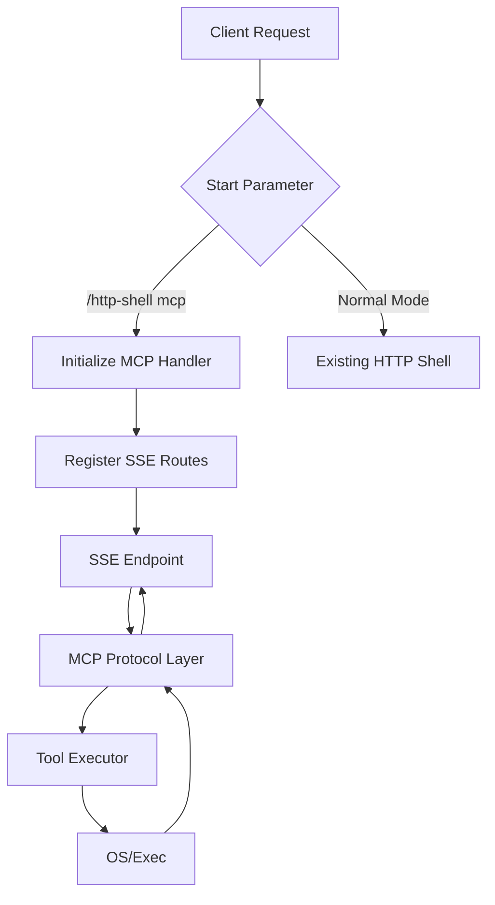
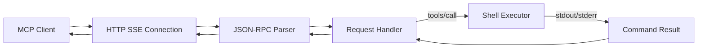

## Product Overview

在现有的 http_shell 项目中实现符合 MCP (Model Context Protocol) SSE 标准的服务端功能。该项目通过特定的启动参数 `/http-shell mcp` 激活 MCP 模式，专门用于向 MCP 客户端暴露执行 shell 命令的工具能力，复用项目现有的命令执行逻辑。

## Core Features

- **MCP SSE 服务端实现**: 构建基于 Server-Sent Events 的 HTTP 服务，支持 MCP 协议的握手、消息传输和资源端点。
- **命令执行工具**: 注册一个标准 MCP Tool，允许客户端发送 shell 命令并在服务端异步执行。
- **启动参数集成**: 修改入口逻辑，解析 `/http-shell mcp` 参数，仅在指定时启动 MCP 服务，不影响原有 HTTP Shell 功能。
- **协议兼容性**: 确保实现符合 MCP SSE 规范，包括 JSON-RPC 消息格式和必要的事件流处理。

## Tech Stack

- **语言**: Go (保持与现有 http_shell 项目一致)
- **HTTP 服务器**: 标准库 `net/http`
- **SSE 处理**: 基于原生 `net/http` 实现流式响应
- **JSON 处理**: `encoding/json`
- **命令执行**: `os/exec`

## Architecture Design

### System Architecture

系统采用单体架构，在现有 HTTP 服务基础上新增 MCP SSE 路由。



### Module Division

- **main**: 入口模块，解析启动参数，决定初始化常规 HTTP 服务或 MCP 服务。
- **mcp_server**: MCP SSE 服务核心模块，负责握手、SSE 连接维护和消息分发。
- **protocol**: 处理 MCP JSON-RPC 协议编解码（Request, Response, Notification）。
- **tools**: 定义并管理可用的 MCP 工具，包含 `execute_shell_command` 的具体实现。
- **transport**: 封装 SSE 底层写入逻辑，管理 `Flusher` 和事件格式。

### Data Flow



### Key Code Structures

```
// Main routing structure
func main() {
    if os.Args[1] == "mcp" {
        startMCPServer()
    } else {
        startHTTPShell()
    }
}

// MCP Tool Definition
type Tool struct {
    Name        string
    Description string
    InputSchema map[string]interface{}
}

// MCP Request/Response Wrapper
type MCPMessage struct {
    JSONRPC string      `json:"jsonrpc"`
    ID      interface{} `json:"id,omitempty"`
    Method  string      `json:"method,omitempty"`
    Params  interface{} `json:"params,omitempty"`
    Result  interface{} `json:"result,omitempty"`
    Error   *MCPError   `json:"error,omitempty"`
}
```

### Technical Implementation Plan

1. **Problem Statement**: 需要支持长连接 SSE 服务。

- **Solution**: 使用 `http.ResponseWriter` 的 `http.Flusher` 接口实时发送数据。
- **Steps**:

    1. 创建 SSE 端点 handler，检查 Flusher 支持。
    2. 设置响应头 `Content-Type: text/event-stream` 和 `Cache-Control: no-cache`。
    3. 循环监听客户端消息并写入响应流。

2. **Problem Statement**: 集成现有 shell 执行逻辑。

- **Solution**: 将 `cmd` 参数处理逻辑提取为独立函数，供 MCP Tool 调用。
- **Steps**:

    1. 提取 `execCommand` 函数。
    2. 在 MCP Tool handler 中调用该函数。
    3. 捕获输出并封装为 MCP Tool 响应。

### Integration Points

- **与 Main 集成**: 通过 flag 或参数判断逻辑分支。
- **协议层**: 使用标准 JSON 格式与客户端交互，确保字段严格匹配 MCP 规范。

该需求为后端服务开发，不涉及用户界面 (UI) 设计，因此无需生成具体的设计方案。

## Agent Extensions

### Skill

- **skill-creator** (from <skills>)
- Purpose: 指导创建 MCP 协议实现的 Skill，确保代码结构和规范符合最佳实践。
- Expected outcome: 生成的 Go 代码结构清晰，MCP 握手和工具调用逻辑正确。