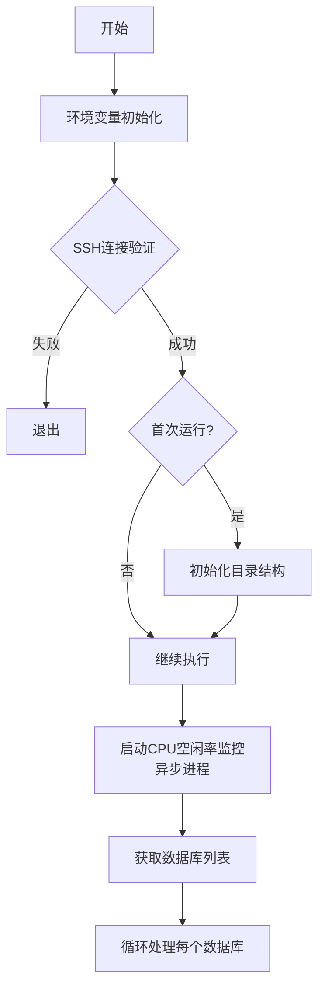
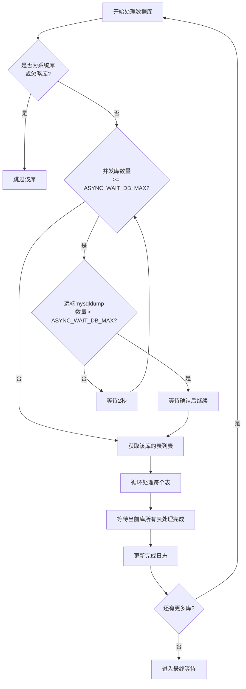
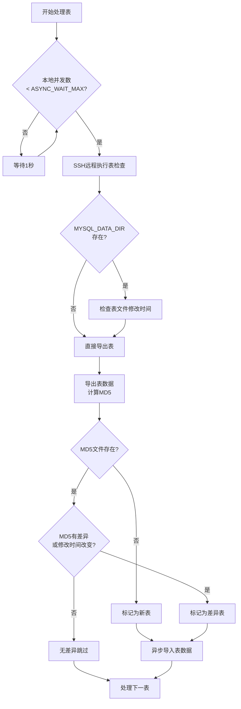
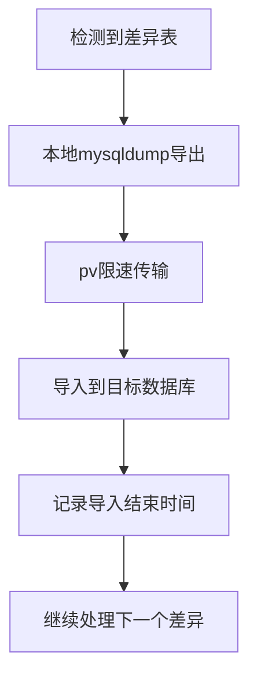
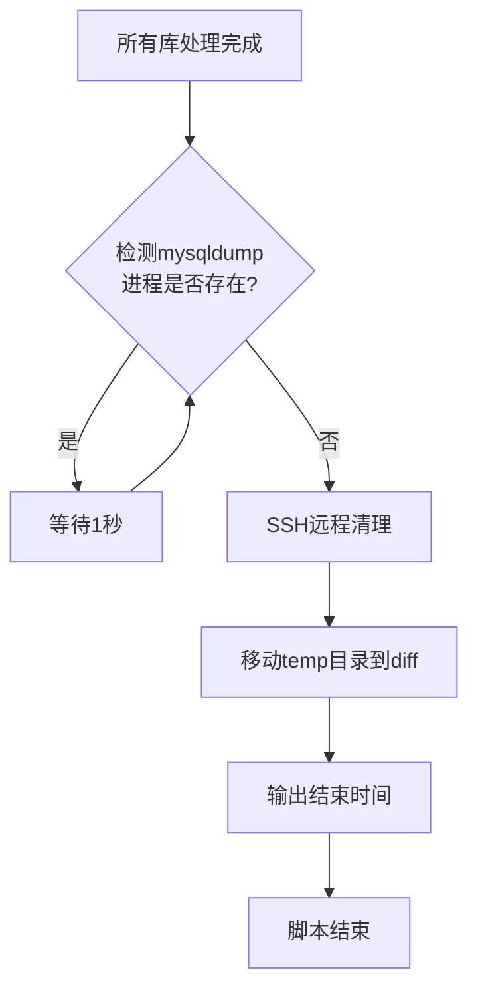

# dump-import.md5.pv.sh 流程图

## 整体流程

## 数据库处理流程

## 表处理流程（并发）

## 表导入流程

## 最终清理流程

## 关键参数说明

| 参数 | 默认值 | 说明 |
|------|--------|------|
| `DB_PORT` | 3306 | 数据库端口 |
| `ASYNC_WAIT_MAX` | 100 | 最大并发表数量 |
| `ASYNC_WAIT_DB_MAX` | 10 | 最大并发库数量 |
| `DUMP_PV` | 6m | pv限速 |
| `DUMP_WAIT_SECONDS` | 0.6 | 表处理间隔秒数 |
| `CPUQUOTA` | - | systemd CPU配额限制 |
| `IONICE_C` | - | ionice IO优先级 |

## 并发控制策略

1. **库级别并发控制**: 同时处理的库数量不超过 `ASYNC_WAIT_DB_MAX`
2. **表级别并发控制**: 同时运行的 mysqldump 进程不超过 `ASYNC_WAIT_MAX`
3. **远端监控**: 实时监控远端 mysqldump 进程数量，避免过载
4. **资源限制**: 支持 systemd CPU配额 和 ionice IO优先级 限制
